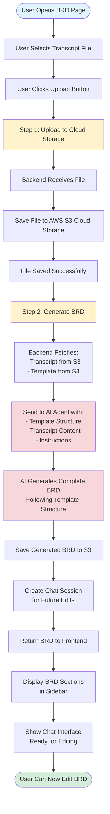

```mermaid
flowchart TD
    Start([User Wants to Edit BRD]) --> SelectSection[User Selects Section<br/>from Sidebar]
    
    SelectSection --> ShowSection[Section Content<br/>Displayed in Chat]
    ShowSection --> UserTypes[User Types Edit Command<br/>e.g., 'change $2.3M to $4M here']
    
    UserTypes --> SendMessage[Frontend Sends Message to Backend<br/>with Section Context]
    
    SendMessage --> LoadSession[Backend Loads Chat Session<br/>from Memory]
    LoadSession --> GetHistory[Retrieve Previous<br/>Conversation History]
    
    GetHistory --> LoadBRD[Load Current BRD<br/>from Cloud Storage]
    LoadBRD --> IdentifySection[AI Identifies Which Section<br/>to Edit]
    
    IdentifySection --> BuildPrompt[Build AI Prompt with:<br/>- Current Section Content<br/>- User's Edit Request<br/>- Conversation History]
    
    BuildPrompt --> CallAI[Send to AI Agent]
    CallAI --> AIEdit[AI Generates Updated Section<br/>Following User's Instructions]
    
    AIEdit --> UpdateBRD[Update BRD Document]
    UpdateBRD --> SaveToCloud[Save Updated BRD<br/>to Cloud Storage]
    
    SaveToCloud --> SaveMessage[Save AI Response<br/>to Chat Memory]
    SaveMessage --> ReturnResponse[Return Response to Frontend]
    
    ReturnResponse --> DisplayUpdate[Display Updated Section<br/>in Chat Interface]
    DisplayUpdate --> UpdateSidebar[Update Section Content<br/>in Sidebar]
    
    UpdateSidebar --> End([Edit Complete ✅])
    
    style Start fill:#e1f5ff
    style End fill:#d4edda
    style SelectSection fill:#fff3cd
    style UserTypes fill:#fff3cd
    style CallAI fill:#f8d7da
    style AIEdit fill:#f8d7da
    style SaveToCloud fill:#d1ecf1
```

# BRD System Flow Diagrams

This document explains how the BRD (Business Requirements Document) generation and editing system works, designed for both technical and non-technical audiences.

---

## 📋 Table of Contents

1. [BRD Generation Flow](#brd-generation-flow)
2. [BRD Editing Flow](#brd-editing-flow)
3. [Combined Overview](#combined-overview)
4. [Simple Explanations](#simple-explanations)

---

## 🔄 BRD Generation Flow

### Visual Flow Diagram (Mermaid)



### Text Flow Diagram

```
┌─────────────────────────────────────────────────────────────┐
│                    BRD GENERATION FLOW                       │
└─────────────────────────────────────────────────────────────┘

1. USER ACTION
   └─> User selects transcript file (meeting notes, etc.)
   └─> User clicks "Upload Files" button

2. FILE UPLOAD TO CLOUD
   └─> Frontend sends file to Backend
   └─> Backend saves file to AWS S3 Cloud Storage
   └─> ✅ File stored securely in cloud

3. BRD GENERATION
   └─> Backend fetches:
       • Transcript file from S3
       • BRD Template from S3
   └─> Backend sends both to AI Agent
   └─> AI Agent reads template structure
   └─> AI Agent extracts information from transcript
   └─> AI Agent generates complete BRD document
   └─> ✅ BRD saved to S3

4. DISPLAY RESULTS
   └─> BRD sections appear in sidebar
   └─> Chat interface becomes active
   └─> User can now view and edit BRD

⏱️  Total Time: 1-3 minutes
```

### Step-by-Step Process

1. **User Uploads File**
   - User selects a transcript file (Word document, text file, etc.)
   - Clicks the "Upload Files" button

2. **File Storage**
   - File is sent to the backend server
   - Backend saves the file to AWS S3 cloud storage
   - File is stored securely with a unique ID

3. **BRD Generation**
   - Backend retrieves:
     - The uploaded transcript from S3
     - The BRD template from S3
   - Both are sent to the AI agent
   - AI agent analyzes the template structure
   - AI agent extracts relevant information from the transcript
   - AI agent generates a complete BRD following the template

4. **Results Display**
   - Generated BRD is saved to S3
   - A chat session is created for future edits
   - BRD sections appear in the sidebar
   - Chat interface becomes active
   - User can immediately start editing

---

## ✏️ BRD Editing Flow

### Visual Flow Diagram (Mermaid)



### Text Flow Diagram

```
┌─────────────────────────────────────────────────────────────┐
│                      BRD EDITING FLOW                       │
└─────────────────────────────────────────────────────────────┘

1. USER SELECTS SECTION
   └─> User clicks section in sidebar (e.g., "Section 3: Background")
   └─> Section content appears in chat

2. USER REQUESTS EDIT
   └─> User types command:
       • "change $2.3M to $4M here"
       • "update section 4: change Sarah to Aman"
       • "show section 5"
   └─> User clicks Send

3. SYSTEM PROCESSES REQUEST
   └─> Frontend sends message + section context to Backend
   └─> Backend loads:
       • Chat session from Memory (previous conversations)
       • Current BRD from Cloud Storage
   └─> Backend identifies which section to edit

4. AI GENERATES UPDATE
   └─> AI Agent receives:
       • Current section content
       • User's edit request
       • Previous conversation history
   └─> AI Agent generates updated section
   └─> AI Agent follows user's instructions precisely

5. SAVE & DISPLAY
   └─> Updated BRD saved to Cloud Storage
   └─> AI response saved to Chat Memory
   └─> Updated section displayed in chat
   └─> Sidebar updated with new content

⏱️  Total Time: 5-15 seconds
```

### Step-by-Step Process

1. **User Selects Section**
   - User clicks on a section in the sidebar (e.g., "Section 3: Background / Context")
   - The section content is displayed in the chat interface

2. **User Types Edit Command**
   - User types a natural language command:
     - "change $2.3M to $4M here"
     - "update section 4: change Sarah to Aman"
     - "show section 5"
   - User clicks Send

3. **System Processes Request**
   - Frontend sends the message along with section context to the backend
   - Backend loads:
     - Chat session from AgentCore Memory (remembers previous conversations)
     - Current BRD from S3 cloud storage
   - System identifies which section needs to be edited

4. **AI Generates Update**
   - AI agent receives:
     - Current section content
     - User's edit request
     - Previous conversation history (for context)
   - AI agent understands the request and generates an updated section
   - AI agent follows the user's instructions precisely

5. **Save and Display**
   - Updated BRD is saved to S3 cloud storage
   - AI response is saved to chat memory for future reference
   - Updated section is displayed in the chat interface
   - Sidebar is automatically updated with the new content

---

## 🎯 Combined Overview

### System Architecture Diagram


### Visual Summary

```
┌──────────────────────────────────────────────────────────────┐
│                    BRD GENERATION                             │
├──────────────────────────────────────────────────────────────┤
│                                                               │
│   📄 File  ──>  ☁️ Cloud  ──>  🤖 AI  ──>  📋 BRD           │
│                                                               │
│   Upload      Store        Generate      Display              │
│                                                               │
└──────────────────────────────────────────────────────────────┘

┌──────────────────────────────────────────────────────────────┐
│                    BRD EDITING                                │
├──────────────────────────────────────────────────────────────┤
│                                                               │
│   👆 Select  ──>  ✍️ Type  ──>  🤖 AI  ──>  ✅ Updated      │
│                                                               │
│   Section     Edit Request   Process      See Changes        │
│                                                               │
└──────────────────────────────────────────────────────────────┘
```

---

## 📖 Simple Explanations

### What Happens When You Generate a BRD

**In Simple Terms:**
1. You upload a file (meeting notes, transcript, etc.)
2. The system saves it to cloud storage
3. An AI agent reads your file and a template
4. The AI creates a complete BRD document
5. The BRD appears in sections on your screen
6. You can start editing immediately

**Key Points:**
- ✅ Your file is stored securely in the cloud
- ✅ The AI follows a standard template structure
- ✅ The entire process takes 1-3 minutes
- ✅ You get a complete, professional BRD document

### What Happens When You Edit a BRD

**In Simple Terms:**
1. You click a section (e.g., "Section 3: Background")
2. You type what you want to change (e.g., "change $2.3M to $4M")
3. The system remembers your previous conversations
4. The AI updates that section
5. The updated section appears instantly
6. Your changes are saved automatically

**Key Points:**
- ✅ You can edit using natural language (no special commands needed)
- ✅ The system remembers context from previous conversations
- ✅ Changes are saved automatically to the cloud
- ✅ The entire process takes 5-15 seconds

---

## 🔑 Key Features

### BRD Generation
- ✅ Automatic document generation from transcripts
- ✅ Follows standard BRD template structure
- ✅ Extracts key information intelligently
- ✅ Creates professional, well-organized documents

### BRD Editing
- ✅ Natural language editing (no coding required)
- ✅ Context-aware (remembers previous conversations)
- ✅ Section-specific edits (knows which section you're working on)
- ✅ Instant updates and automatic saving

### System Benefits
- ✅ Cloud-based storage (access from anywhere)
- ✅ AI-powered (intelligent understanding of requests)
- ✅ Persistent memory (remembers conversation history)
- ✅ User-friendly interface (simple and intuitive)

---

## 📊 Timing Summary

| Process | Typical Time | What Happens |
|---------|--------------|--------------|
| **BRD Generation** | 1-3 minutes | File upload → AI processing → Document creation |
| **BRD Editing** | 5-15 seconds | User request → AI update → Display results |
| **Section Selection** | Instant | Click section → Content appears |
| **File Upload** | 5-10 seconds | Upload to cloud storage |

---

## 🛠️ Technical Components

### Frontend (User Interface)
- React-based web application
- Runs in web browser
- Handles user interactions
- Displays BRD sections and chat interface

### Backend (API Server)
- FastAPI Python server
- Handles file uploads
- Coordinates with cloud services
- Manages chat sessions

### Cloud Services
- **AWS S3**: File storage (transcripts, templates, BRDs)
- **AWS Bedrock**: AI agent for generation and editing
- **AgentCore Memory**: Conversation history storage

---

## 📝 Notes

- All files are stored securely in AWS S3 cloud storage
- Chat sessions are maintained in AgentCore Memory (up to 365 days)
- The AI agent uses Claude Sonnet 4.5 for intelligent document processing
- The system is designed to be user-friendly and require no technical knowledge

---

## 📞 Support

For questions or issues, please refer to the main project documentation or contact the development team.

---

**Last Updated:** 2025-01-27  
**Version:** 1.0


